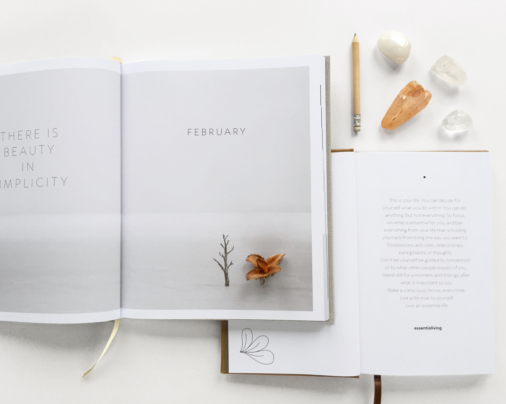

# eCommerce
This is an eCommerce website I have been working on.
This project is very significant to me because it took me weeks on the making trial and error different things.
Over time, I mastered the project that took place as a result of many skills picked up on udemy.com and codingphase.com.

The hamburger located at the left side upper corner works
The contact page (visible option when you click the hamburger) works.
The combination of css, html, js, and images work great.

Index

<!DOCTYPE html>
<html lang="en">
<head>
      <meta charset="UTF-8">
      <meta name="viewport" content="width=device-width, initial-scale=1.0">
      <meta http-equiv="X-UA-Compatible" content="ie=edge">
      <meta name="author" content="Belzarion - franguardado28@gmail.com">
      <link rel="icon" href="yourIconUrl" type="image/gif" sizes="16x16">
      <title>The Zurfaro - The website is designed by Zurfaro/Belzarion</title>

      <link rel="stylesheet" href="style.css">

      <link rel="stylesheet" href="https://stackpath.bootstrapcdn.com/bootstrap/4.3.1/css/bootstrap.min.css">
      

      

      <link href="https://fonts.googleapis.com/css?family=Playfair+Display&display=swap" rel="stylesheet">

      

      

      <link rel="stylesheet" href="animate.css">
      
</head>
<body>
      

            

                  

                        <ion-icon name="menu"></ion-icon>
                  

                  

                        <a href="index.html">The Zurfaro</a>
                  

                  

                        <ion-icon name="cart"></ion-icon>
                  

                  

                        

                              <ion-icon name="close"></ion-icon>
                        

                        <ul>
                              <li><a href="index.html">Home</a></li>
                              <li><a href="shop.html">collection</a></li>
                              <li><a href="product.html">Product</a></li>
                              <li><a href="about.html">Our story</a></li>
                              <li><a href="contact.html">Contact</a></li>
                        </ul>
                        

                              <ul>
                                    <li><ion-icon name="logo-facebook"></ion-icon></li>
                                    <li><ion-icon name="logo-instagram"></ion-icon></li>
                                    <li><ion-icon name="logo-twitter"></ion-icon></li>
                                    <li><ion-icon name="logo-pinterest"></ion-icon></li>
                              </ul>
                        

                  

            

            

                  

                        

                              

                                    

                                          
Amazing engines to inspire   motivate, and multiply activity   ingenuity.

                                    

                                    

                                          
Appreciative ground shipping on U.S. orders $50+   Go and check what you want!!!

                                    

                              

                              

                                    

                                          
                                    

                              

                        

                  

            

            

                  

                        

                              

                                    <a href="product.html">
                                          
 VALERIE USD $20.00

                                          
                                          
Day-to-day Administrator 2019 in Green

                                    </a>
                              

                              

                                    <a href="product.html">
                                          
 DEVON USD $50.00

                                          
                                          
Day-to-day Administrator 2019/2020 in Blue

                                    </a>
                              

                              

                                    <a href="product.html">
                                          
GRIFFIN USD $20.00

                                          
                                          
Day-to-day Administrator 2019 in Brown

                                    </a>
                              

                              

                                    <a href="product.html">
                                          
LUKE USD $75.00

                                          
                                          
Day-to-day Administrator in Dark Brown

                                    </a>
                              

                        

                  

            

            

                  

                        
                  

                  

                          
                        
More doing and less talking is more useful. There is no tomorrow only the today and the now.

                        

                              <a href="shop.html">Go shopping <ion-icon name="arrow-round-forward"></ion-icon></a>
                        

                  

            

            

                  

                        

                              
What are you waiting for? time is always right. The place does not matter, the time does not matter, you have what you need right now and better thingd will come along.   It is important to visit this website everyday! 

                              

                                    <a href="shop.html">Master more <ion-icon name="arrow-round-forward"></ion-icon></a>
                              

                        

                  

                  

                        

                              

                              

                                    
                                    
Belzarion is a Youtube channel that started in 2019 with the purpose to entertain gamers!

                              

                              

                                    
                                    
The Zurfaro, is a station that represents being smart and creative. This channel is specifically made to educate web development and UI/UX!

                              

                              

                                    
                                    
Combine Belzarion and The Zurfaro, what you get is the right combination to never get bored!

                              

                        

                  

            

               

            

                  

                        <footer>
                              

                                    

                                          
The Zurfaro, 250 Rutherford,
                                           
                                          Boston, MA. 02129,
                                           
                                          USA

                                    

                                    

                                          
Corp
                                           
                                          Return Policy
                                           
                                          Shipping

                                    

                                    

                                          
Vanguard
                                           
                                          Community
                                           
                                          Innovation

                                    

                                    

                                          

                                                <ul>
                                                      <li><ion-icon name="logo-facebook"></ion-icon></li>
                                                      <li><ion-icon name="logo-instagram"></ion-icon></li>
                                                      <li><ion-icon name="logo-twitter"></ion-icon></li>
                                                      <li><ion-icon name="logo-pinterest"></ion-icon></li>
                                                </ul>
                                          

                                    

                              

                        </footer>
                  

            

            <!-- FOOTER ENDS -->

      

      
</body>
</html>

CONTACT PAGE CODE

<!DOCTYPE html>
<html lang="en">
<head>
      <meta charset="UTF-8">
      <meta name="viewport" content="width=device-width, initial-scale=1.0">
      <meta http-equiv="X-UA-Compatible" content="ie=edge">
      <meta name="author" content="Belzarion - franguardado28@gmail.com">
      <link rel="icon" href="yourIconUrl" type="image/gif" sizes="16x16">
      <title>Contact - The Zurfaro</title>

      <!-- external stylesheet -->
      <link rel="stylesheet" href="style.css">

      <!-- bootstrapcdn -->
      <link rel="stylesheet" href="https://stackpath.bootstrapcdn.com/bootstrap/4.3.1/css/bootstrap.min.css">
      

      <!-- icon pack -->
      

      <!-- google font -->
      <link href="https://fonts.googleapis.com/css?family=Playfair+Display&display=swap" rel="stylesheet">

      <!-- jquery cdn -->
      

      <!-- tweenmax (greensock) cdn -->
      

      <!-- for on scroll animations -->
      <link rel="stylesheet" href="animate.css">
      
</head>
<body>
      

            <!-- NAVIGATION STARTS -->

            

                  

                        <ion-icon name="menu"></ion-icon>
                  

                  

                        <a href="index.html">The Zurfaro</a>
                  

                  

                        <ion-icon name="cart"></ion-icon>
                  

                  

                        

                              <ion-icon name="close"></ion-icon>
                        

                        <ul>
                              <li><a href="index.html">Home</a></li>
                              <li><a href="shop.html">Collection</a></li>
                              <li><a href="product.html">Product</a></li>
                              <li><a href="about.html">Our story</a></li>
                              <li><a href="contact.html">Contact</a></li>
                        </ul>
                        

                              <ul>
                                    <li><ion-icon name="logo-facebook"></ion-icon></li>
                                    <li><ion-icon name="logo-instagram"></ion-icon></li>
                                    <li><ion-icon name="logo-twitter"></ion-icon></li>
                                    <li><ion-icon name="logo-pinterest"></ion-icon></li>
                              </ul>
                        

                  

            

            <!-- NAVIGATION ENDS -->

            <!-- DATA SECTION STARS -->

            

                  

                        <h1 id="hero-title">Contact Me</h1>
                  

                  

                        
What are you waiting for? time is always right. The place does not matter, the time does not matter, you have what you need right now and better thingd will come along.

                        <form>
                              

                                    <label>Name</label>
                                    <input type="text" class="form-control wow fadeInUp" data-wow-delay="0.5s">
                              

                              

                                    <label>E-MAIL</label>
                                    <input type="email" class="form-control wow fadeInUp" data-wow-delay="0.7s">
                              

                              

                                    <label>MESSAGE</label>
                                    <textarea rows="3" class="form-control wow fadeInUp" data-wow-delay="0.8s"></textarea>
                              

                              

                                    <a href="#">SUBMIT</a>
                              

                        </form>

                  

            

            <!-- DATA SECTION ENDS -->

            <!-- FOOTER STARTS -->

            

                  

                        <footer>
                              

                                    

                                          
The Zurfaro, 250 Rutherford,
                                           
                                          Boston,Massachusetts. 02129,
                                           
                                          USA

                                    

                                    

                                          
CORP
                                           
                                          Return Policy
                                           
                                          Shipping

                                    

                                    

                                          
Careers
                                           
                                          Community
                                           
                                          Wholesale

                                    

                                    

                                          

                                                <ul>
                                                      <li><ion-icon name="logo-facebook"></ion-icon></li>
                                                      <li><ion-icon name="logo-instagram"></ion-icon></li>
                                                      <li><ion-icon name="logo-twitter"></ion-icon></li>
                                                      <li><ion-icon name="logo-pinterest"></ion-icon></li>
                                                </ul>
                                          

                                    

                              

                        </footer>
                  

            

            <!-- FOOTER ENDS -->
            

            
</body>
</html>

SHOP CONTENT CODE

<!DOCTYPE html>
<html lang="en">
<head>
      <meta charset="UTF-8">
      <meta name="viewport" content="width=device-width, initial-scale=1.0">
      <meta http-equiv="X-UA-Compatible" content="ie=edge">
      <meta name="author" content="Belzarion - franguardado28@gmail.com">
      <link rel="icon" href="yourIconUrl" type="image/gif" sizes="16x16">
      <title>Collection - The Zurfaro</title>

      <!-- external stylesheet -->
      <link rel="stylesheet" href="style.css">

      <!-- bootstrapcdn -->
      <link rel="stylesheet" href="https://stackpath.bootstrapcdn.com/bootstrap/4.3.1/css/bootstrap.min.css">
      

      <!-- icon pack -->
      

      <!-- google font -->
      <link href="https://fonts.googleapis.com/css?family=Playfair+Display&display=swap" rel="stylesheet">

      <!-- jquery cdn -->
      

      <!-- tweenmax (greensock) cdn -->
      

      <!-- for on scroll animations -->
      <link rel="stylesheet" href="animate.css">
      
</head>
<body>
      

            <!-- NAVIGATION STARTS -->

            

                  

                        <ion-icon name="menu"></ion-icon>
                  

                  

                        <a href="index.html">The Zurfaro</a>
                  

                  

                        <ion-icon name="cart"></ion-icon>
                  

                  

                        

                              <ion-icon name="close"></ion-icon>
                        

                        <ul>
                              <li><a href="index.html">Home</a></li>
                              <li><a href="shop.html">collection</a></li>
                              <li><a href="product.html">Product</a></li>
                              <li><a href="about.html">My story</a></li>
                              <li><a href="contact.html">Contact</a></li>
                        </ul>
                        

                              <ul>
                                    <li><ion-icon name="logo-facebook"></ion-icon></li>
                                    <li><ion-icon name="logo-instagram"></ion-icon></li>
                                    <li><ion-icon name="logo-twitter"></ion-icon></li>
                                    <li><ion-icon name="logo-pinterest"></ion-icon></li>
                              </ul>
                        

                  

            

            <!-- NAVIGATION ENDS -->

            

            <!-- COLLECTION STARTS -->

            

                  
Best sellers

                  

                        

                              

                                    

                                          <a href="product.html">
                                                
 VALERIE USD $70.00

                                                
                                                
Day-to-day service 2019 acquisition in Green

                                          </a>
                                    

                                    

                                          <a href="product.html">
                                                
DEVON USD $50.00

                                                
                                                
Day-to-day service 2019/2020 in Crimson

                                          </a>
                                    

                                    

                                          <a href="product.html">
                                                
GRIFFIN USD $50.00

                                                
                                                
Day-to-day 2019 in Marron

                                          </a>
                                    

                                    

                                          <a href="product.html">
                                                
LUKE USD $75.00

                                                
                                                
Day-to-day service 2019 in Obscure MIB

                                          </a>
                                    

                              

                        

                  

            

            <!-- COLLECTION ENDS -->

            <!-- BANNER SECTION STARTS -->

            

                  

                        
                  

                  

                          
                        
More doing and less talking is more useful. There is no tomorrow only the today and the now.

                        

                              <a href="shop.html">Go shopping <ion-icon name="arrow-round-forward"></ion-icon></a>
                        

                  

            

            <!-- THIS IS BANNER SECTION ENDS -->

            <!-- COLLECTION AND ACQUISITION STARTS -->

            

                  
Latest acquisition

                  

                        

                              

                                    

                                          <a href="product.html">
                                                
          Valerie USD $70.00

                                                
                                                
Day-to-say service 2019 in Green

                                          </a>
                                    

                                    

                                          <a href="product.html">
                                                
          Devon USD $80.00

                                                
                                                
Day-to-day service 2019/2020 in Dark Blue

                                          </a>
                                    

                                    

                                          <a href="product.html">
                                                
          Griffin USD $20.00

                                                
                                                
Day-to-day service 2019 in Beige

                                          </a>
                                    

                                    

                                          <a href="product.html">
                                                
          Luke USD $25.00

                                                
                                                
Day-to-day service 2019 in Cocoa Brown

                                          </a>
                                    

                              

                        

                  

            

            <!-- COLLECTION ENDS -->

            <!-- CATEGORIES SECTION STARTS -->

            

                  

                        

                              
What are you waiting for? time is always right. The place does not matter, the time does not matter, you have what you need right now and better thingd will come along.

                              

                                    <a href="shop.html">Get more <ion-icon name="arrow-round-forward"></ion-icon></a>
                              

                        

                  

                  

                        

                              

                              

                                    
                                    
Belzarion is a Youtube channel that started in 2019 with the purpose to entertain gamers!

                              

                              

                                    
                                    
The Zurfaro, is a station that represents being smart and creative. This channel is specifically made to educate web development and UI/UX!

                              

                              

                                    
                                    
Combine Belzarion and The Zurfaro, what you get is the right combination to never get bored!

                              

                        

                  

            

            <!-- CATEGORIES SECTION ENDS -->

            

            <!-- FOOTER STARTS -->

            

                  

                        <footer>
                              

                                    

                                          
The Zurfaro, 250 Rutherford,
                                           
                                          Boston, Massachusetts, 02129,
                                           
                                          USA

                                    

                                    

                                          
Corp
                                           
                                          Return Policy
                                           
                                          Shipping

                                    

                                    

                                          
Careers
                                           
                                          Community
                                           
                                          Wholesale

                                    

                                    

                                          

                                                <ul>
                                                      <li><ion-icon name="logo-facebook"></ion-icon></li>
                                                      <li><ion-icon name="logo-instagram"></ion-icon></li>
                                                      <li><ion-icon name="logo-twitter"></ion-icon></li>
                                                      <li><ion-icon name="logo-pinterest"></ion-icon></li>
                                                </ul>
                                          

                                    

                              

                        </footer>
                  

            

            <!-- FOOTER ENDS -->

      

      
</body>
</html>

